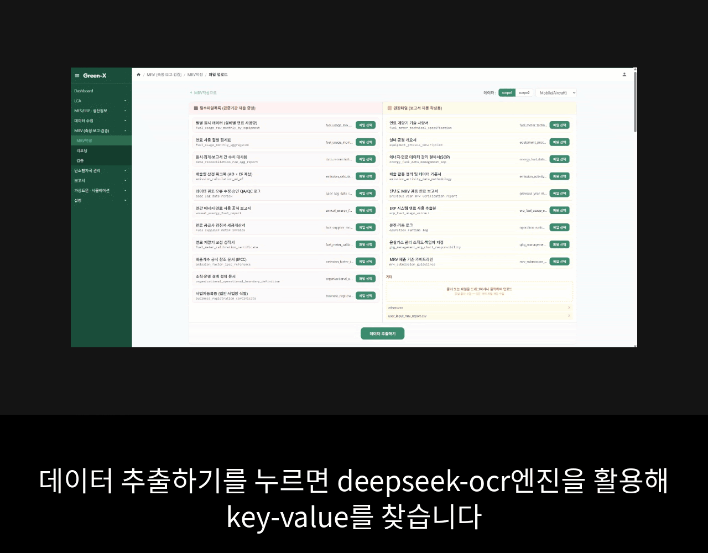

> **[비공개 프로젝트]** 본 저장소는 재직 중인 회사의 업무 프로젝트로, 소속 회사의 정책에 따라 소스 코드를 공개하지 않습니다.  
> This is a private company project. Source code is not disclosed in accordance with company policy.

---

# Green-X — GHG Emissions MRV Automation Platform

> **온실가스 배출량 모니터링·보고·검증(MRV) 자동화 풀스택 플랫폼** 🌿  
> K-ETS(한국 탄소배출권 거래제) · ISO 14064 · IPCC 2006/2019 준거

---

## ✨ 주요 기능 데모 (GIF)

<table>
  <tr>
    <td align="center"><b>1. 📄 문서에서 Key-Value 자동 추출</b></td>
    <td align="center"><b>2. ✍️ MRV 보고서 서술부 자동 생성</b></td>
  </tr>
  <tr>
    <td></td>
    <td></td>
  </tr>
</table>

---

## 👨‍💻 개발자 소개

저는 **AI/ML 전문 개발자**입니다.  
이 프로젝트의 핵심은 **DeepSeek OCR 기반 KV 추출 파이프라인**과 **Qwen2.5-7B 기반 보고서 자동 생성 시스템** — 두 AI 엔진을 직접 설계하고 구현한 것입니다.

백엔드, 프론트엔드 등 나머지 풀스택 영역은 **AI 코딩 어시스턴트(Vibe Coding)를 개발 파트너로 적극 활용**하여 구현했습니다.  
AI를 전략적으로 활용해 개발 생산성을 극대화하고, 핵심 AI 엔진 설계와 같은 고부가가치 작업에 더 많은 시간을 투자할 수 있었습니다.

---

## 🎯 프로젝트 목표 및 비즈니스 가치

기존의 온실가스 배출량 보고(MRV) 프로세스는 다양한 형식의 문서를 수작업으로 취합하고, 복잡한 규정에 맞춰 계산하며, 서술형 보고서를 작성하는 등 **많은 시간과 비용이 소요되며 사람에 의한 오류 발생 가능성이 높습니다.**

Green-X는 이 모든 과정을 자동화하여 다음과 같은 가치를 제공합니다:
- **⏰ 시간 및 비용 절감:** 문서 분석부터 보고서 작성까지의 시간을 획기적으로 단축합니다.
- **📈 데이터 정확도 향상:** 자동화된 규칙 엔진과 교차검증을 통해 사람의 실수를 최소화합니다.
- **⚖️ 규제 준수 리스크 감소:** K-ETS, ISO 등 최신 국제 표준을 준수하여 보고 품질을 보장합니다.

---

## 🤖 핵심 AI 구현 — 이 프로젝트의 본질

### 1. DeepSeek OCR 기반 문서 → KV 추출 파이프라인

> **"어떤 형식의 문서든 업로드하면 GHG 보고에 필요한 Key-Value를 자동으로 추출한다"**

단순 OCR 호출이 아닙니다. 모델 출력(Raw Markdown)을 신뢰할 수 있는 구조화 데이터로 변환하는 **전체 로직을 직접 설계**했습니다.

```
문서 (PDF / Excel / Word / HWP / CSV)
        ↓  포맷별 PNG 변환 (PyMuPDF, OpenPyXL, Mammoth, PyHWP)
DeepSeek OCR — 4-bit 양자화, Flash Attention 2
        ↓  Raw Markdown 텍스트 출력
마크다운 테이블 파싱 → 3×3 이상 테이블 자동 감지·CSV 저장
LaTeX 수식 → Unicode 변환  (\(_{2}\) → ₂)
        ↓
필드별 노이즈 정규화 (사람 이름 / 숫자 / 배출계수 / Scope 복합값)
소스별 신뢰도 스코어링 → 다중 문서에서 최적값 선택
        ↓
Scope 자동 감지 (항공·선박·천연가스·경유 키워드 + 단위 패턴)
        ↓
IPCC 규칙 엔진 → 50개 이상 필드 자동 파생
        ↓
OCR값 ↔ 파생값 교차검증 (DERIVED_WINS / OCR_WINS / FLAG 정책)
        ↓
최종 확정 KV → PostgreSQL 저장 + MinIO 원본 보관
```

**직접 설계한 핵심 로직:**

- **dtype 불일치 패치** — DeepSeek OCR 비전 인코더(float32)와 LLM 임베딩(bfloat16) 충돌을 `masked_scatter_` 몽키패치로 해결
- **KV 교차검증 엔진** — OCR 오인식과 시스템 계산값 충돌 시 키별 해소 정책(3종) 자동 적용
- **필드 별칭 매핑** — 한/영 200개 이상 필드 별칭을 정의하고 소스별 우선순위 스코어링으로 최적값 선택
- **Scope 자동 감지** — 연료명·시설명·단위 패턴으로 Scope 1/2/3 및 세부 유형 자동 분류

---

### 2. Qwen2.5-7B 기반 MRV 보고서 자동 생성

> **"DB에 저장된 수치 데이터를 읽어 K-ETS / ISO 14064 규격의 보고서 텍스트를 LLM이 자동으로 작성한다"**

단순 프롬프트 호출이 아닙니다. **보고서 섹션별로 독립된 15개 모듈**로 파이프라인을 설계하고, 품질 보장을 위한 후처리까지 직접 구현했습니다.

**템플릿 태그 기반 모듈 호출 설계:**

```
보고서 템플릿에 {{llm:yoy_analysis|ref=db:emission,db:prior_year_emission}} 태그 삽입
        ↓
태그 파싱 → ref 키로 DB에서 컨텍스트 조회
        ↓
Qwen2.5-7B API 호출 (모듈별 system prompt + user message)
        ↓  SSE 스트리밍으로 프론트에 실시간 전송
한국어 전용 규칙 주입 + CJK 한자 필터링 (Qwen의 중국어 혼입 방지)
        ↓
최종 보고서 텍스트 DB 저장
```

**구현한 15개 생성 모듈:**

| 모듈 | 생성 내용 |
|---|---|
| `yoy_analysis` | 전년 대비(YoY) 배출량 변화 분석 |
| `boundary_justification` | 조직 경계 설정 근거 |
| `scope_narrative` | Scope 포함/제외 서술 |
| `qc_note_activity` / `qc_note_ef` / `qc_note_uncertainty` | 품질관리(QC) 메모 |
| `fuel_reduction_levers` | 연료 절감 방안 제안 |
| `industry_benchmark` | 업계 벤치마크 비교 |
| `monthly_spike_analysis` | 월별 이상 급등 분석 |
| `reconciliation_checks` | 대사(Reconciliation) 검증 서술 |
| `dqi_basis` | 데이터 품질 지수(DQI) 근거 |
| `reporting_principles` | ISO 14064 보고 원칙 서술 |
| + 4개 추가 모듈 | 선언문, 책임 진술, 비용 분석 등 |

---

## ⚙️ 풀스택 구현 — AI 어시스턴트 활용

AI 파이프라인을 실제 서비스로 연결하기 위한 나머지 영역은 바이브 코딩으로 구현했습니다.

```
┌─────────────┐  ┌─────────────┐  ┌────────────┐  ┌──────────┐
│  Frontend   │  │   Backend   │  │ PostgreSQL │  │  MinIO   │
│  React+Vite │→│  FastAPI    │→│  asyncpg  │  │  Object  │
│  :8080      │  │  :4000      │  │  :5432    │  │  Storage │
└─────────────┘  └─────────────┘  └────────────┘  └──────────┘
                        ↓
              ┌─────────────────────┐
              │  DeepSeek OCR (GPU) │  ← 별도 Compose
              │  Qwen2.5 7B  (GPU) │  ← 별도 Compose
              └─────────────────────┘
```

- **Backend** — FastAPI, asyncpg 비동기 DB 풀, SSE 스트리밍 응답
- **Frontend** — React SPA, MRV 3단계 워크플로, Recharts 대시보드
- **Infra** — Docker Compose 멀티 컨테이너, PostgreSQL 7테이블 정규화 설계

---

## 🛠️ 기술 스택

| 분류 | 기술 |
|---|---|
| **AI/ML (핵심)** | DeepSeek OCR (4-bit quantized), Qwen2.5-7B, Flash Attention 2 |
| **Backend** | Python 3.11, FastAPI, asyncpg, uvicorn, httpx |
| **Frontend** | React 18, Vite, Tailwind CSS, Recharts |
| **Database** | PostgreSQL 15 |
| **Storage** | MinIO (S3 호환) |
| **Infra** | Docker, Docker Compose |
| **문서 처리** | PyMuPDF, Pillow, OpenPyXL, xlrd, WeasyPrint, PyHWP, Mammoth |
| **규정 준거** | K-ETS, ISO 14064-1/3:2018/2019, IPCC 2006/2019 |

---

## ✅ 구현 상태

| 기능 | 상태 |
|---|---|
| DeepSeek OCR KV 추출 파이프라인 | ✅ 완성 |
| Qwen2.5-7B 보고서 자동 생성 (15모듈) | ✅ 완성 |
| Scope 1 파생 엔진 (이동·고정 연소) | ✅ 완성 |
| KV 교차검증 엔진 | ✅ 완성 |
| 대시보드 (KPI·차트) | ✅ 완성 |
| Scope 2/3 파생 엔진 | 🔄 확장 예정 |
